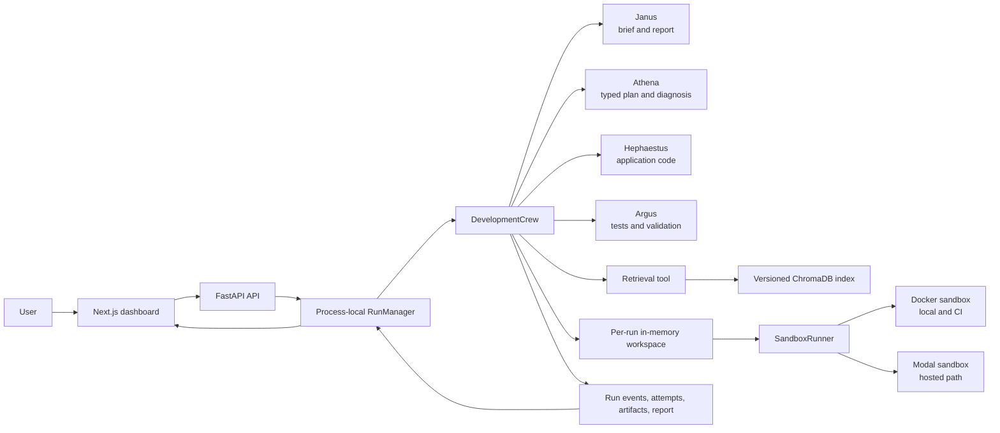
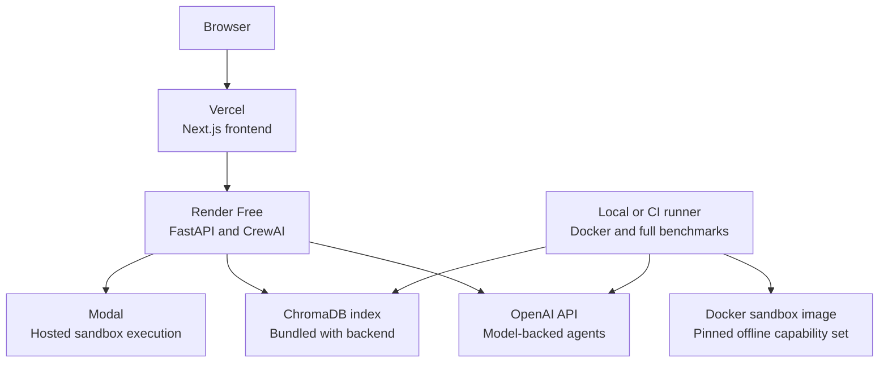
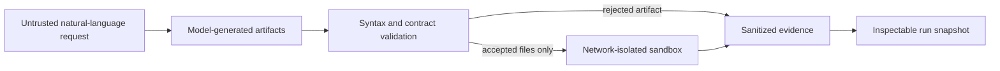

# The Digital Forge architecture

This document describes the implemented system as of the current mainline. It separates the research workflow from the public deployment and benchmark paths.

## Logical architecture

The frontend uses asynchronous `POST /runs` submission and polls `GET /runs/{run_id}`. The API also retains a synchronous `POST /run` compatibility endpoint. `GET /benchmarks` reads tracked report files and does not start model execution.

## Deployment topology

Render is not the Docker execution host, so the hosted configuration selects Modal. Local and CI benchmark runs select Docker. Both adapters implement the same sandbox contract and use the pinned capability set defined for generated code execution.

## Component responsibilities

### API and run coordination

`backend/main.py` exposes health, run submission, polling, cancellation, and benchmark-report endpoints. `RunManager` owns process-local snapshots, worker threads, cancellation events, the one-active-run limit, and the daily model-run budget. The API layer applies the per-client rate limit.

### Orchestration

`backend/pipeline.py` creates one `DevelopmentCrew` per request. The crew owns a `RunState`, a fresh `RunWorkspace`, the agent instances, file tools, retrieval tools, and a selected sandbox adapter. Agent outputs are converted into typed plans before implementation begins.

### Execution and self-healing

Generated Python and pytest files are syntax-checked before being saved. The sandbox receives only the two generated files, runs pytest with fixed time, memory, CPU, process, and network limits, and returns structured output. Failures are classified as application, test, infrastructure, timeout, resource, or contract failures. Candidate attempts are capped at three; retryable infrastructure failures do not consume a candidate attempt.

### Evidence

Each run records stage events, the technical brief, typed plan, generated artifacts, retrieval events, test output, candidate attempt history, and final report. Benchmark reports are separate immutable files with model, task, evaluator, sandbox, and task-level result metadata.

## Trust boundaries and state boundaries

The in-memory workspace is scoped to one run and is not shared between requests. Run snapshots are also process-local. This keeps the public demo simple, but it means state is lost on restart and is not a durable production data store.
