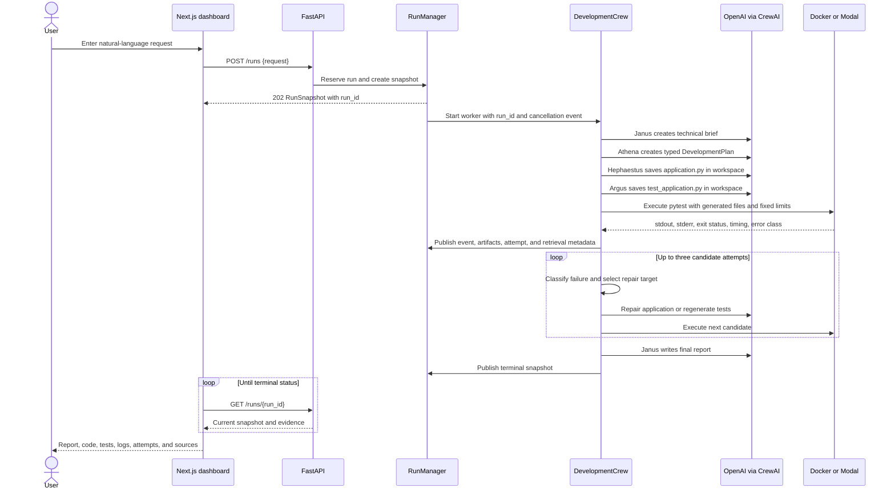
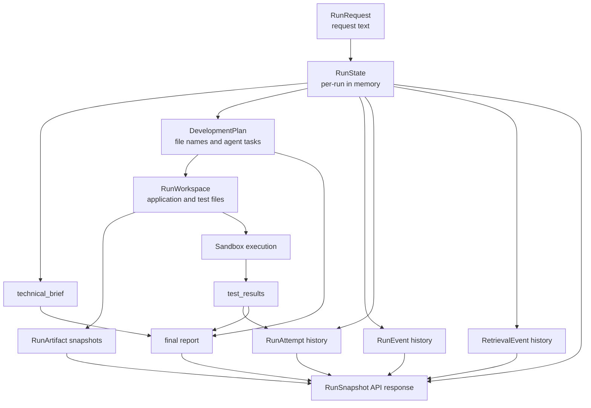
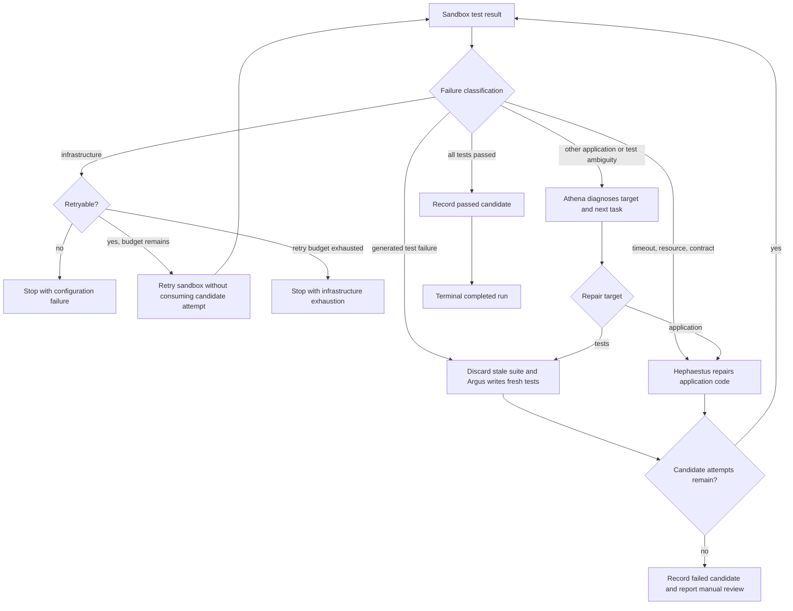
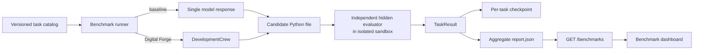

# The Digital Forge data flow

This document follows a request from the browser through generation, execution, repair, and reporting.

## Live run lifecycle

## State and data ownership

`RunState` is the internal mutable workflow state. `RunSnapshot` is the read model returned to the frontend. The run manager copies state into snapshots under a lock, so polling never receives a live mutable workspace object.

## Repair decision flow

Infrastructure retries are recorded as `infrastructure` attempts but do not increment the candidate-attempt counter. A generated test failure causes the old test suite to be discarded before Argus writes a fresh suite, preventing incorrect assertions from anchoring the repair.

## Benchmark data flow

The benchmark evaluator is independent from the agent-generated tests. The public dashboard reads existing report files and never runs the full benchmark or spends model tokens.
